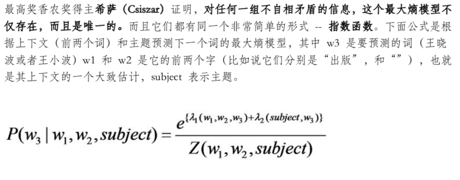
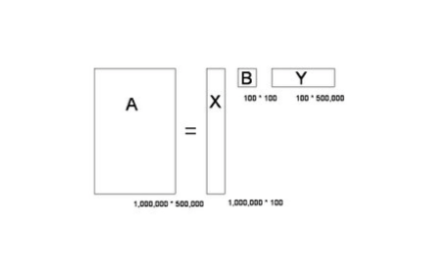

### 系列一 统计语言模型

- 对于一个文字序列能够构成一个能够被理解的句子，可以用一个简单的统计模型去解决
- 如果用S表示一连串特定顺序排列的词w1,w2,...,wn，换句话说，S可以表示某一个由一连串特定顺序排列的词而组成的一个有意义的句子。机器对语言的识别从某种角度来说就是想知道S在文本中出现的可能性。则P(S)=P(w1)P(w2|w1)P(w3|w1w2)...p(wn|w1w2...wn-1)。由于可能性太多，因此我们假定任意一个词wi出现概率只同它前面的词wi-1有关（马尔科夫假设），则现在P(S)=P(w1)P(w2|w1)P(w3|w2)...p(wn|wn-1)。现在的问题变成了如何估计P(wi|wi-1)，而根据概率学，P(wi|wi-1)=P(wi,wi-1)/P(wi-1)。
- 事实证明，统计语言模型比任何已知的借助某种规则的解决方法都有效。

### 系列二 中文分词
- 统计语言模型是建立在词的基础上的，对于中文，首先就需要进行分词。
- 查字典分词法，就是把一个句子从左向右扫描一遍，遇到字典中的词就标识出来，遇到复合词就找最长匹配，遇到不认识的字串就分割成单字。
- 统计语言模型解决分词二义性问题。假定一个句子S可以有几种分词方法，假定有以下三种：A1，A2,···，Ak；B1，B2，···，Bm；C1，C2，···，Cn，那么最好的一种分词方法就是保证分完词后这个句子出现的概率最大。
- 根据不同应用，汉语分词的颗粒度大小应该不同

### 系列三 隐含马尔可夫模型在语言处理中的应用
- 根据接收到的信息推测说话者想表达的意思。当我们观测到语音信号o1，o2，o3时，我们要根据这组信号推测出发送句子s1，s2，s3。显然我们应当找出，在已知o1，o2，o3的情况下，条件概率P(s1,s2,s3|o1,o2,o3)达到最大值的那个s1，s2，s3，这个条件概率等价为P(o1,o2,o3|s1,s2,s3)* P(s1,s2,s3)，其中P(o1,o2,o3|s1,s2,s3)表示某句话s1，s3，s3被读成o1，o2，o3的可能性，而P(s1,s2,s3)表示字串s1，s2，s3本身能够成为一个合乎情理的句子的可能性。我们现在假设一是s1，s2，s3是一个马尔科夫链，二是第i时刻接受信号oi只由发送信号si决定，则就可以很容易利用算法找出最大值。
- 满足上边两个假设的模型就是隐含马尔可夫模型

### 系列四 怎么度量信息
- 信息熵。用比特这个概念来度量信息量，对于任何一个随机变量X，它的熵定义为p1*logp1+p2*logp2+···+pn*logpn+···,变量的不确定性越大，熵也就越大。

### 系列五 布尔代数和搜索引擎的索引
- 布尔运算，所有的数学和逻辑运算都能转换成二值的布尔运算
- 简单的索引结构，用一个二进制数表示一个关键字是否出现在搜索的每篇文献中，每一位对应一篇文献，1代表相应的文献有这个关键字。由于这些二进制数的绝大部分位数都是0，我们只需要记录那些等于1的位数即可，于是搜索引擎的索引就变成了一张大表。

### 系列六 图论和网络爬虫
- 图论。图论讨论的是由一些节点和连接这些节点的弧组成。关于图的算法其中最重要的是图的遍历算法，其中有广度优先算法（BFS），即尽可能广地访问每个节点的邻节点，和深度优先算法（DFS），即沿着特定的规律一路往下访问，到尽头后，回头访问岔路。
- 网络爬虫。将每个网页当做一个节点，网页之间的超链接当做连接网页的弧。

### 系列七 信息论在信息处理中的应用
- 语言模型复杂度。信息熵是对不确定性的衡量，因此信息熵可以直接用于衡量统计语言模型的好坏。
- 互信息和相对熵。互信息是对两个随机事件相关性的度量，相对熵是用来衡量两个正函数是否相似，对于两个完全相同的函数，它们的相对熵等于零。

### 系列八 如何确定网页和查询的相关性
- 对关键词的次数进行归一化，用关键词的次数除以网页的总字数，称为关键词的频率TF
- 对汉语中的每一个词一个权重，一个词的预测主题能力越强，权重越大，应删除词的权重为零。逆文本频率指数IDF，公式为log(D/Dw)其中D是全部网页数，Dw是关键词w在Dw个网页中出现过。这样相关性的计算就变成了TF1*IDF1+TF2*IDF2+···
- TF/IDF的概念被公认为信息检索中最重要的发明。IDF的概念就是一个特定条件下、关键词的频率分布的交叉熵

### 系列九 有限状态机和地址识别
- 一个有限状态机是一个特殊的有向图，它包括一些状态和连接这些状态的有向弧。每一个有限状态机都有一个起始状态和一个终止状态和若干中间状态。如果一条地址能从状态机的起始状态经过状态机的若干中间状态，走到终止状态，那么这条地址则有效，否则无效。
- 使用有限状态机识别地址，关键要解决两个问题，即通过一些有效的地址建立状态机，以及给定一个有限状态机后，地址字串的匹配算法

### 系列十 余弦定理和新闻的分类
- 新闻的特征向量。一篇新闻中的单词和这个单词的TF/IDF的值，这些TF/IDF的数值组成了这篇新闻的特征向量，如果两篇新闻的特征向量相近，则对应的新闻内容相似
- 余弦定理、两条新闻的特征向量的夹角的余弦等于1时，这两条新闻这完全重复，接近1时，两条新闻相似，从而可以归于一类。

### 系列十一 最大熵模型
- 最大熵。保留全部的不确定性，将风险降到最少
- 当我们需要对一个随机事件的概率分布进行预测时，应当满足全部已知的条件，而对未知的情况不要做任何主观假设
- 对任何一组不自相矛盾的信息，这个最大熵模型不仅存在而且是唯一的

- 构造最大熵模型。确定指数函数的参数，这个过程称为模型的训练。最原始的模型是通用迭代算法GIS

### 系列十二 搜索引擎作弊
- 抓作弊的方法类似于信号处理中的去噪音的办法
- 原始的信号混入噪音，相当于两个信号做卷积，噪音消除的过程是一个解卷积的过程

### 系列十三 矩阵运算和文本处理中的分类问题
- 文本分类。利用矩阵运算中的奇异值分解（SVD）
- SVD举例。用一个大矩阵A来描述一百万篇文章和五十万词的关联性，每一行对应一篇文章，每一列对应一个词，每个元素的值就是这个词在这篇文章中的加权词频（即TF/IDF）。奇异值分解就是把这个矩阵分解成三个小矩阵相乘，比如将A分解成一个一百万乘以一百的矩阵X，一个一百乘以一百的矩阵B和一个一百万乘以五十万的矩阵Y。

第一个矩阵X汇总的每一行代表相关的一类词，其中每个非零元素表示这类词中每个词的重要性（相关性），数值越大越相关。最后一个矩阵Y中的每一列表示同一主题一类文章，其中每个元素表示这类文章中每篇文章的相关性。中间的矩阵则表示类词和文章之间的相关性。我们通过对A进行奇异值分解，同时完成了近义词分类和文章的分类。

### 系列十四 马尔科夫链扩展贝叶斯网络
- 贝叶斯网络。节点表示一个状态，状态之间的连线表示它们的因果关系。每个节点概率的计算，可以用贝叶斯公式进行。
- 和马尔科夫链类似，贝叶斯网络的每个状态值取决于前面有限个状态，要知道各个状态之间相关的概率，需要用已知的数据进行训练。

### 系列十五 布隆过滤器
- 布隆过滤器。实际上是一个很长的二进制向量和一系列随机映射函数
- 举例。假定存储一亿个电子邮箱地址，我们先建立一个十六亿进制，然后将这十六亿个二进制全部设置为零，对于每一个电子邮件地址X，我们用八个不同的随机数产生器产生8个信息指纹，再用一个随机数产生器把这8个信息指纹映射到1到十六亿中的8个自然数。然后将这8个位置的二进制全部设置为1，当我们对一亿个邮箱地址进行这样的处理后，一个针对这些email地址的过滤器就建成了。
